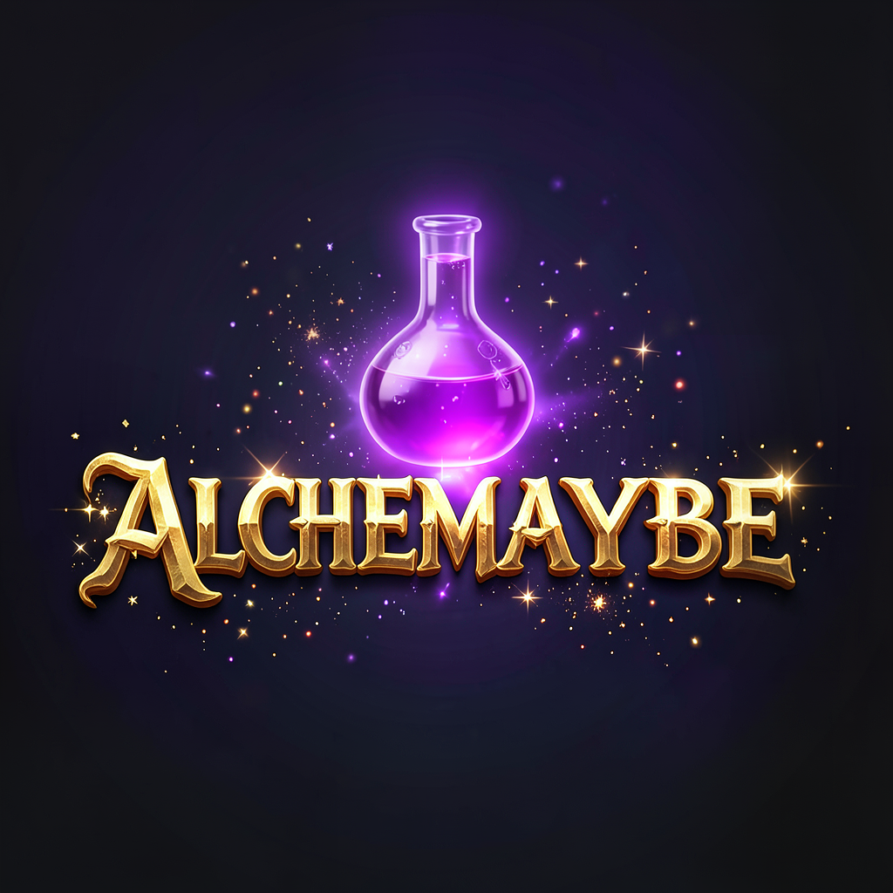

<p align="center">
  
</p>

<h1 align="center">Alchemaybe</h1>

<p align="center">
  An AI-powered alchemy card game on Solana. Combine elemental materials, craft unique items, and battle for board control — every card is generated by local LLMs and can be minted as an NFT.
</p>

---

## How It Works

Players draw a hand of **materials** (Fire, Water, Stone, Metal...) and **intents** (Sharp, Heavy, Ancient, Many...), then combine them to craft real-world objects. A local LLM validates every combination — Fire + Metal + Sharp = Steel Katana, Clay + Hollow + Many = Terracotta Army.

Place crafted cards on a 3x3 board of random categories (Weapon, Transport, Medicine...). If someone already holds a cell, an AI judge decides whose card fits the category better. First to control **5 cells** wins.

Every crafted card gets unique AI-generated artwork rendered into an ornate card frame. Connect a Phantom wallet to mint your discoveries as Metaplex Core NFTs on Solana devnet.

## Game Modes

- **vs Bot** — Play against an LLM-powered opponent that reasons about which cards to combine and where to place them
- **PvP** — Coming soon

## Tech Stack

| Component | Technology |
|-----------|-----------|
| Backend | Rust, Axum, Tokio |
| Frontend | Vanilla JS, CSS |
| LLM | Ollama (local — no cloud APIs) |
| Image Gen | Flux2-klein via Ollama |
| Card Rendering | `image` + `imageproc` crates |
| Blockchain | Solana SDK, Metaplex Core |
| Wallet | Phantom (web3.js) |

## Architecture

The project is a Cargo workspace with three crates:

```
alchemaybe/
├── generation/     # LLM server (:3000) — card combining, image gen, judging, bot AI
├── game/           # Game server (:3001) — state management, Solana integration, static frontend
│   └── static/     # Web UI (HTML/JS/CSS)
├── explore/        # Offline card discovery analysis tool
├── scripts/        # Solana collection setup, card pre-generation
├── cards.json      # 14 materials + 13 intents
└── categories.json # 30 board categories
```

The **generation server** wraps Ollama for all LLM tasks — card combination with validation, artwork generation, dispute judging, and bot decision-making. The **game server** manages game state, serves the frontend, caches discovered cards, and handles Solana wallet interactions (minting, burning, pack purchases).

## Prerequisites

- [Rust](https://rustup.rs/) (stable)
- [Ollama](https://ollama.ai/) for local LLM inference
- [Node.js](https://nodejs.org/) (only needed for Solana collection setup scripts)

## Quick Start

```bash
# 1. Clone and enter the repo
git clone https://github.com/user/alchemaybe.git
cd alchemaybe

# 2. Copy environment config
cp .env.example .env

# 3. Pull the required Ollama models
make setup

# 4. Start both servers (generation + game)
make run
```

Open **http://localhost:3001** and start playing.

## Configuration

### Required (`.env`)

```env
OLLAMA_URL=http://localhost:11434
OLLAMA_MODEL=gemma3:4b
OLLAMA_IMAGE_MODEL=x/flux2-klein:4b
GENERATION_URL=http://localhost:3000
RUST_LOG=info
```

### Solana NFT Integration

To enable wallet features (minting crafted cards as NFTs, buying packs, combining on-chain):

```env
SOLANA_KEYPAIR_PATH=~/.config/solana/id.json
SOLANA_RPC_URL=https://devnet.helius-rpc.com/?api-key=YOUR_KEY
HELIUS_API_KEY=your-helius-api-key
COLLECTION_ADDRESS=your-collection-pubkey
PUBLIC_BASE_URL=http://localhost:3001
```

**One-time collection setup:**

```bash
cd scripts && npm install
SOLANA_KEYPAIR_PATH=~/.config/solana/id.json \
SOLANA_RPC_URL=https://devnet.helius-rpc.com/?api-key=YOUR_KEY \
node create-collection.js
```

This prints a `COLLECTION_ADDRESS` to add to your `.env`. The game works fully without Solana — blockchain features degrade gracefully when not configured.

## On-Chain Features

All Solana interactions use **devnet** and Metaplex Core:

- **Claim** — Mint any crafted card you've discovered as an NFT in your Phantom wallet
- **Combine** — Burn 2-4 owned NFT cards to combine them into a new NFT (atomic burn+mint transaction)
- **Buy Packs** — Purchase randomized card packs with SOL
- **Wallet View** — See all your owned Alchemaybe NFTs queried via the Helius DAS API

Card metadata and images are served from the game server and linked in on-chain NFT metadata.

## Card System

**14 Materials:** Fire, Water, Wind, Light, Stone, Metal, Clay, Wood, Bone, Fiber, Egg, Seed, Sand, Coal

**13 Intents:** Loud, Bright, Soft, Sharp, Sweet, Cold, Tiny, Heavy, Hollow, Sticky, Ancient, Many, Time

**30 Board Categories:** Weapon, Armor, Shield, Tool, Container, Light Source, Musical Instrument, Clothing, Food or Drink, Building Material, Shelter, Transport, Art or Decoration, Medicine, Trap or Hazard, Signal Device, Fuel Source, Rope or Binding, Lens or Optics, Writing Implement, Currency, Hunting Gear, Farm Equipment, Navigation Aid, Ritual Object, Poison or Venom, Toy or Game, Insulation, Bridge or Crossing, Machine

Combine 2-4 cards (at least one material, at most one intent). The LLM must produce a valid real-world object — no abstract concepts allowed.
